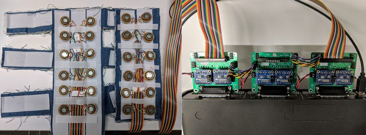

# Audio-to-Tactile Representation

(This is not an official Google product!)

The motivation of this project is to enable users with hearing loss to "feel"
sound and understand speech through vibrotactile interfaces. Our vision is a
wearable tactile device that enables users to feel sound in a natural and
effective way. The goal is that this representation is intuitive enough to
require only minimal training while effective enough to deliver tangible
read-world value, especially in understanding speech and complementing lip
reading.

## Contents

 * [Tactile processor](doc/tactile_processor.md): demo of our approach to
   audio-to-tactile processing, taking input audio from the microphone and
   producing output on a 10-tactor interface.

 * [Phone embedding](doc/phone_embedding.md): low-latency network that maps
   input audio into a 2D embedding where phones are distinct.

 * [Tactophone](doc/tactophone.md): training game for the 24-tactor TActile
   Phonemic Sleeve (TAPS) system described in
> Charlotte M. Reed, Hong Z. Tan, Zachary D. Perez, E. Courtenay Wilson,
> Frederico M. Severgnini, Jaehong Jung, Juan S. Martinez, Yang Jiao, Ali
> Israr, Frances Lau, Keith Klumb, Robert Turcott, Freddy Abnousi, ["A
> Phonemic-Based Tactile Display for Speech
> Communication,"](https://doi.org/10.1109/TOH.2018.2861010) *IEEE Transactions
> on Haptics*, 2018.

 * [play buzz](doc/play_buzz.md): simple diagnostic program that plays a
   sinusoid to a specified channel.


## License

This code uses the Apache License 2.0. See the LICENSE file for details.


## Hardware

This software is intended to be used with a tactile sleeve as described in the
Reed et al. work linked above.



The sleeve is constructed from cloth and Velcro. The 24 tactors are
[Tectonic TEAX13C02-8/RH speakers](https://www.parts-express.com/tectonic-teax13c02-8-rh-13mm-exciter-8-ohms--297-214)
with vinyl bumpers glued to them, and with Velcro on the back so that they can
be repositioned on the sleeve. To play tactile signals through the tactors, we
used a [Motu 24Ao](http://motu.com/products/avb/24ai-24ao) audio interface
device. The Motu has DB25 D-Sub connectors that output 8 channels each. We use
custom boards to connect to the DB25 D-Sub outputs, amplify them with [MAX98306
Stereo Amplifiers](https://www.adafruit.com/product/987), and connect through
two ribbon cables to the tactors.

For the Motu's input, we connect by USB to a computer running the Tactophone
program.

## Building

This project uses the [bazel](https://www.bazel.build) build system. There is
also a `make` makefile, but it does not include all targets. Install bazel,
Python3 development files, and libraries:

```{.sh}
sudo apt-get install bazel libsdl2-dev portaudio19-dev libncurses-dev libvpx-dev
sudo apt-get install python3-dev python3-pip
pip3 install jax dm-haiku absl-py matplotlib scipy sklearn
```

In `defs.bzl`, check that `PYTHON_INCLUDE_DIRS` points to the correct place for
Python headers:

```{.py}
PYTHON_INCLUDE_DIRS = [
    "/usr/include/python3.6m",
    "/usr/include/x86_64-linux-gnu/python3.6m",
]
```

### Basic bazel use

In case you are new to bazel, here is a quick intro. The [bazel "getting
started" guide](https://docs.bazel.build/versions/master/getting-started.html)
might also be useful. As a starting example, open a terminal and set the working
directory to the root of this repo, then run this command:

```{.sh}
bazel build -c opt audio/tactile:run_tactile_processor
```

When bazel is done, it should print something like

```{.sh}
INFO: Analyzed target //audio/tactile:run_tactile_processor (18 packages loaded, 121 targets configured).
INFO: Found 1 target...
Target //audio/tactile:run_tactile_processor up-to-date:
  bazel-bin/audio/tactile/run_tactile_processor
INFO: Elapsed time: 1.218s, Critical Path: 0.62s
INFO: 24 processes: 24 linux-sandbox.
INFO: Build completed successfully, 28 total actions
```

This command told bazel to build the target
`audio/tactile:run_tactile_processor` with optimization turned on (`-c opt`).
The built binary is at `bazel-bin/audio/tactile/run_tactile_processor`. The
build configuration of this target is represented in a special "BUILD" file. If
you look in `audio/tactile/BUILD` around line 130, there is a stanza in
Python-like syntax defining how to build this binary:

```{.py}
c_binary(
    name = "run_tactile_processor",
    srcs = ["run_tactile_processor.c"],
    deps = [
        ":channel_map",
        ":portaudio_device",
        ":post_processor",
        ":run_tactile_processor_assets",
        ":tactile_processor",
        ":util",
        "//audio/dsp/portable:fast_fun",
        "//audio/dsp/portable:math_constants",
        "//audio/dsp/portable:read_wav_file",
        "//audio/tactile/sdl:basic_sdl_app",
        "//audio/tactile/sdl:texture_from_rle_data",
        "//audio/tactile/sdl:window_icon",
    ],
)
```

I am not intending at this point to dig into the details of this syntax [and
hopefully it is pretty self explanatory]. This is just a quick initial overview
of how bazel fits together.

Here are a couple other bazel commands to try:

```{.sh}
# Build tactile_worker Python extension library. Checks that Python headers are set up.
bazel build -c opt audio/tactile/python:tactile_worker.so

# Run all the unit tests in the repo. Checks that everything is building and working Ok.
bazel test ...
```

